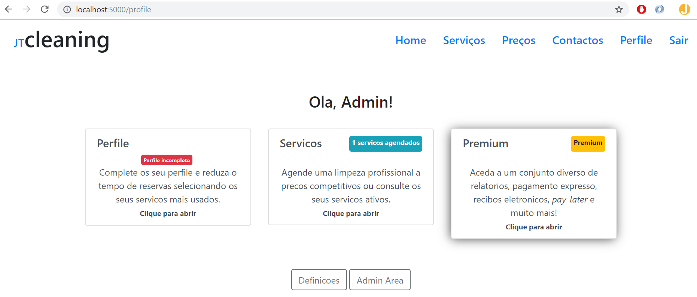
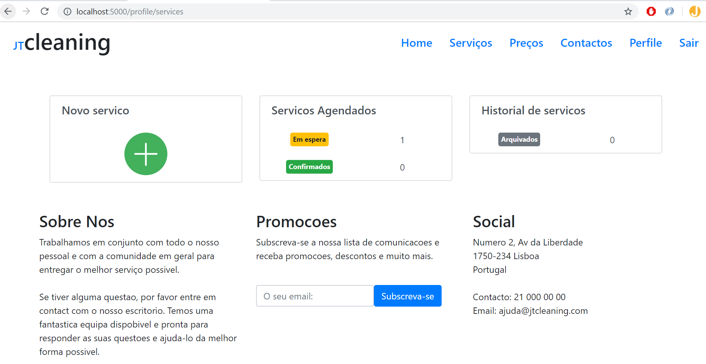
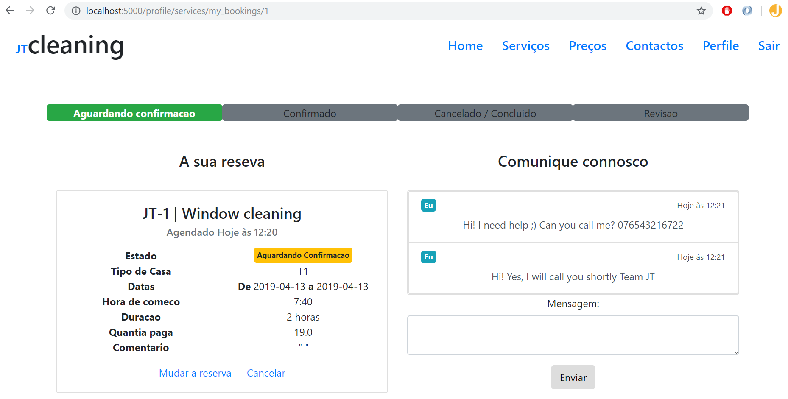
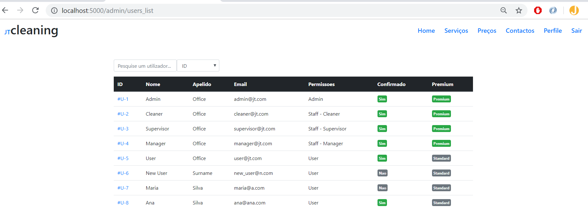
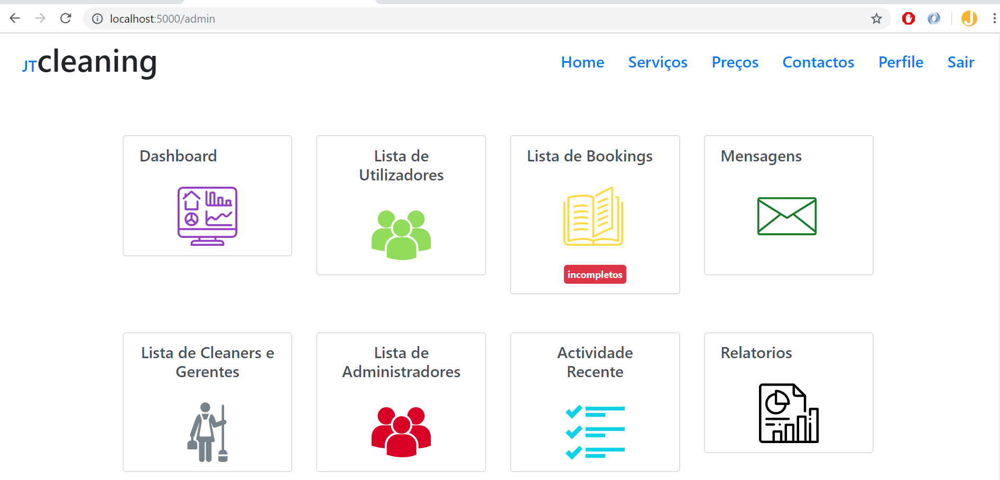
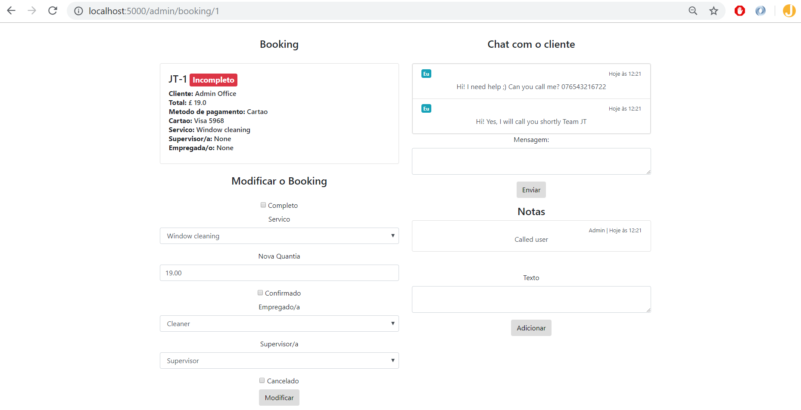

## jtCleaning - a Flask application 

### [Download the video]() of this application in action. Worth it!

Main features:
+ Main website 
+ User registration with email confirmation via JWT tokens
+ Reset password and change email via JWT tokens
+ User checkout of services
+ Admin area to manage Users, Services, Messages, Rates, Staff, Membership, Payments
+ Reporting tool in admin area
+ Recent activity
+ Stripe integration for payments (test mode only)

Stack:
+ Python Flask (handles requests, authentication, routing and db queries)
+ SQLAlchemy (this example uses an sqlite db but could integrate mysql)
+ DB Migrations done via Flask-Migrate
+ Bootstrap layout for both main website and admin-area
+ FullCalendar.js plugin
+ Stripe for payments

Main page gif

Profile page

New service request page. Also visible the historical requests and requests pending approval from the staff. 

Inside a request (user view)
Custom worklfow layout, chat on the right with admin (not websockets) 

Admin area
8 views:
+ Dashboard
+ Users list
+ Bookings lists
+ Messages
+ Cleaners and Managers list
+ Admins list
+ Recent activity
+ Reporting tool

Inside a booking - Admin view
Can modify bookings, chat with the client, add internal notes to the booking, assign a cleaner and a supervisor.

## Reason behind this project
A family member (hence the Portuguese language everywhere) challenged me to create a fully working website whereby the users / clients could register, confirm their email, login, request services and pay online. Users need to have to the option to cancel and modify bookings, so a profile page was designed which allows for changes and for communication with the staff. Users can also opt for a membership.

Cleaners login to their profile to check on jobs they are assigned to, communicate with the office and clients. 

The admins, on the otherhand, would be able to login to an admin area, where they can manage users, staff, requests, payments and run some reports. On the admin area, staff is assigned to a request and provided with the details of the client and location.